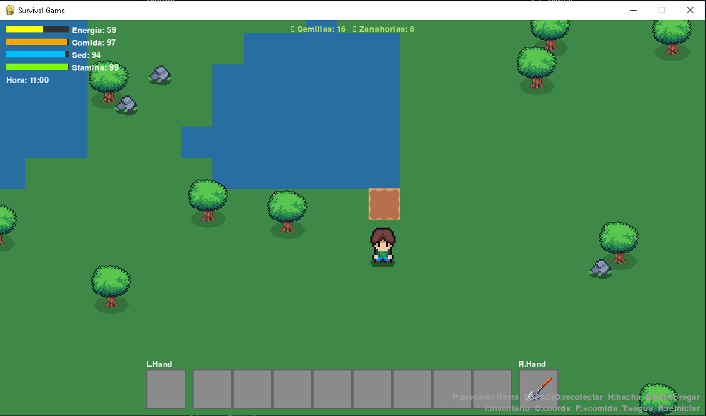
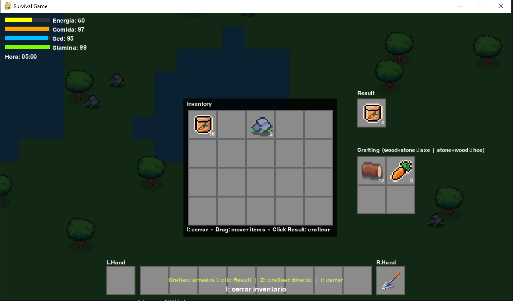
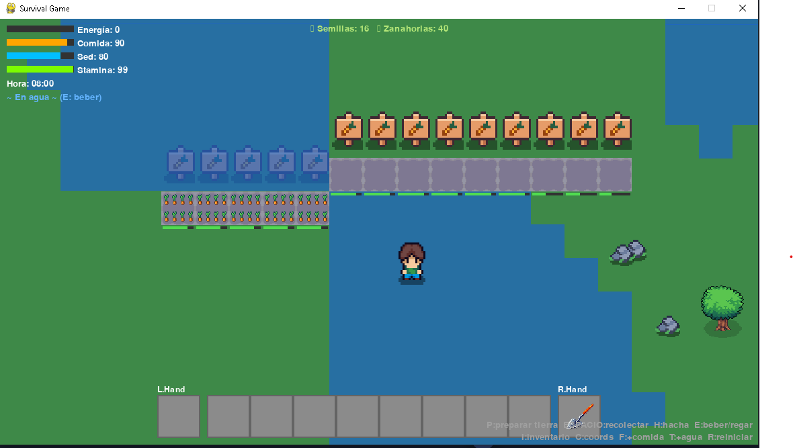

# 🎮 Survival Game (pygame)

Juego de supervivencia en 2D hecho con **Python + Pygame**.  
El jugador debe gestionar energía, comida, sed y stamina mientras recolecta recursos, cultiva parcelas y craftea herramientas.

---

## ✨ Características principales

- Movimiento con WASD o flechas, correr con Shift.
- Sistema de **inventario** con hotbar, manos y crafting 2×2.
- **Recetas disponibles**:
  - `wood + stone → axe`
  - `stone + wood → hoe`
  - `wood + carrot → 4 carrot_seed`
- **Agricultura**:
  - Preparar tierra con la pala.
  - Plantar hasta 8 semillas por parcela.
  - Riego automático si hay agua cerca, o manual con tecla `R`.
  - Crecimiento por etapas y cosecha de zanahorias.
- **HUD** con barras de energía, comida, sed y stamina.
- Ciclo día/noche con reloj interno.

---

## ⌨️ Controles

- **WASD / Flechas**: mover
- **Shift**: correr
- **H**: usar hacha (chop)
- **G**: usar pala (hoe)
- **P**: plantar semilla
- **R**: regar manualmente
- **E / SPACE**: interactuar (beber / recolectar / cosechar)
- **I**: abrir/cerrar inventario
- **C**: craftear
- **Esc**: salir

---

## 📦 Instalación

1. Clonar el repositorio:
   ```bash
   git clone https://github.com/capry99/pygame-survival-game.git
   cd pygame-survival-game
   ```
   Instalar dependencias:

bash
pip install pygame
Ejecutar el juego:

bash
python main.py
🛠️ Requisitos
Python 3.10+

Pygame 2.6+

## 📸 Capturas

### Interfaz principal



### Inventario y crafting



### Agricultura


🚧 Roadmap
Modularizar más el código (separar entities, ui, render).

Añadir más recetas y cultivos.

Guardar/cargar partida.

Mejorar animaciones y efectos visuales.

Implementar enemigos y animales interactivos.

📄 Licencia
Este proyecto se distribuye bajo la licencia MIT. Puedes usarlo, modificarlo y compartirlo libremente, siempre citando al autor original.
